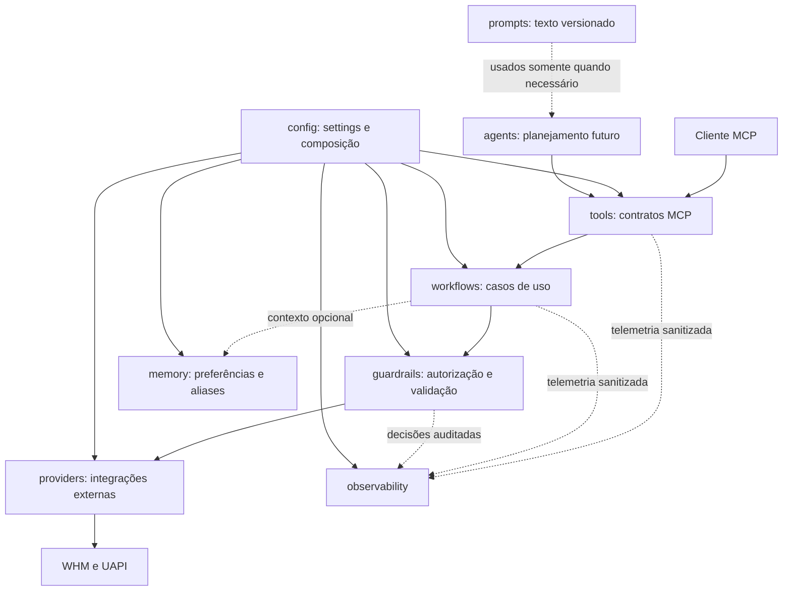
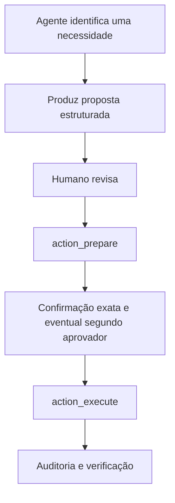

# Guia incremental de evolução do harness

- Status: guia vivo
- Público: pessoas iniciantes no projeto
- Escopo: organização interna do `cpanel-reseller-mcp`
- Decisão de referência: [ADR-001](adr-001-modular-harness-and-memory.md)

## Objetivo

Este guia explica como evoluir o código atual para uma arquitetura modular composta por:

```text
agents/
workflows/
providers/
prompts/
tools/
memory/
guardrails/
observability/
config/
```

A árvore é um destino incremental, não uma tarefa única. Uma pasta deve ser criada somente quando
existir uma responsabilidade concreta para colocar nela. Pastas vazias, abstrações sem uso e
movimentações puramente estéticas aumentam a complexidade sem melhorar o sistema.

O servidor continuará sendo um monólito modular e determinístico. WHM/UAPI permanece como fonte
de verdade operacional; SQLite permanece como fonte transacional e de auditoria. Memória e
agentes não podem substituir guardrails, autorização, confirmação ou auditoria.

## Modelo mental

O fluxo desejado é:



Regras de dependência:

1. `tools/` expõe contratos MCP e delega o trabalho.
2. `workflows/` contém jornadas determinísticas e coordena as dependências.
3. `guardrails/` decide se uma operação pode prosseguir.
4. `providers/` conversa com sistemas externos, mas não decide permissões.
5. `observability/` recebe eventos sanitizados; não controla o fluxo de negócio.
6. `memory/` é opcional e nunca participa da autorização.
7. `prompts/` pode orientar um modelo, mas nunca representa política de segurança.
8. `agents/` fica acima das ferramentas seguras e nunca acessa providers diretamente.

## Mapa do código atual

| Responsabilidade | Local atual | Destino provável |
| --- | --- | --- |
| Ferramentas MCP | `src/reseller_mcp/server.py` | `tools/` |
| Dossiê e health check | `src/reseller_mcp/account_workflows.py` | `workflows/` |
| Cliente WHM/UAPI | `src/reseller_mcp/cpanel.py` | `providers/cpanel/` |
| RBAC, escopo e schema | `src/reseller_mcp/policy.py` | `guardrails/` |
| Confirmação e aprovação | `src/reseller_mcp/harness.py` | `guardrails/` |
| Métricas locais | `src/reseller_mcp/observability.py` | `observability/metrics.py` |
| Auditoria e redação | `src/reseller_mcp/audit.py` | `observability/audit.py` |
| Settings | `src/reseller_mcp/config.py` | `config/settings.py` |
| Composição das dependências | `src/reseller_mcp/runtime.py` | `config/bootstrap.py` ou `runtime.py` |
| Memória | contrato reservado, sem chamadas | `memory/` |
| Prompts | instruções em `server.py` | `prompts/`, somente quando justificado |
| Agentes | inexistente por decisão | `agents/`, somente após gatilho arquitetural |

## Regras para trabalhar com segurança

Cada pull request deve:

- tratar uma única responsabilidade;
- preservar os contratos MCP, salvo mudança explicitamente documentada;
- incluir ou atualizar testes;
- manter negação por padrão em falhas de segurança;
- evitar dependências circulares;
- manter tokens, bancos, logs e dados operacionais fora do Git;
- passar pelo CI e pela revisão exigida na `main`;
- deixar a produção verificável pelo health check e com rollback disponível.

Não combine, no mesmo PR, movimentação de arquivos com mudança relevante de comportamento. Primeiro
faça a extração mantendo o comportamento; depois faça a evolução funcional em outro PR.

## Preparação de cada mudança

Partindo de uma cópia local existente:

```bash
cd /caminho/para/cpanel-reseller-mcp
git checkout main
git pull --ff-only
uv sync --frozen --extra dev
uv run pytest -q
```

Crie uma branch com propósito único:

```bash
git checkout -b refactor/nome-da-etapa
```

Durante a implementação, execute frequentemente:

```bash
uv run ruff format --check .
uv run ruff check .
uv run mypy src/reseller_mcp
uv run pytest -q
```

Antes do commit:

```bash
git diff
git diff --check
git status --short
```

O commit deve ser assinado e não deve conter trailers de coautoria:

```bash
git add <arquivos-alterados>
git commit -S -m "refactor(workflows): extract account workflows"
git push -u origin refactor/nome-da-etapa
gh pr create
```

Nunca envie uma alteração diretamente para `main`.

## Ordem recomendada

| Etapa | Pacote | Motivo para essa ordem |
| --- | --- | --- |
| 0 | Linha de base | Provar que o comportamento atual está saudável |
| 1 | `workflows/` | Há uma responsabilidade concreta e um módulo grande |
| 2 | `providers/` | Permite testar workflows sem acessar cPanel real |
| 3 | `guardrails/` | Centraliza decisões críticas hoje espalhadas |
| 4 | `tools/` | Reduz o tamanho de `server.py` sem mover regra de negócio |
| 5 | `config/` | Formaliza composição e seleção de implementações |
| 6 | `observability/` | Consolida métricas, auditoria e tracing sanitizado |
| 7 | `memory/` | Adiciona Mem0 atrás de contrato opcional e seguro |
| 8 | `prompts/` | Só existe quando houver prompt MCP ou agente real |
| 9 | `agents/` | Última etapa, após necessidade não determinística comprovada |

## Etapa 0 — congelar a linha de base

Objetivo: garantir que uma reorganização não seja confundida com correção funcional.

1. Execute todos os testes.
2. Registre quantos testes existem e quais ferramentas MCP são públicas.
3. Confirme que os exemplos em `docs/api-contracts.md` representam o comportamento atual.
4. Para cada refatoração, compare as respostas antes e depois.

Critério de conclusão:

- testes atuais passam;
- o build do container passa;
- não há mudança de contrato ainda não documentada.

## Etapa 1 — criar `workflows/`

`account_workflows.py` já possui responsabilidade concreta e volume suficiente para virar pacote.

Estrutura inicial:

```text
src/reseller_mcp/workflows/
├── __init__.py
└── accounts.py
```

Primeiro PR:

1. Crie o pacote.
2. Mova `AccountWorkflows` e `DOSSIER_SECTIONS` para `workflows/accounts.py`.
3. Atualize o import usado pelo harness.
4. Preserve temporariamente o módulo antigo como compatibilidade:

```python
from .workflows.accounts import AccountWorkflows, DOSSIER_SECTIONS

__all__ = ["AccountWorkflows", "DOSSIER_SECTIONS"]
```

5. Não altere nomes de ferramentas, parâmetros ou formatos de resposta.
6. Rode todos os testes.

Quando `accounts.py` voltar a crescer, faça novos PRs para separar:

```text
workflows/
├── accounts.py       # resolução e inspeção
├── dossier.py        # montagem das seções
└── healthcheck.py    # interpretação de achados
```

Um workflow:

- não conhece FastMCP;
- não lê variáveis de ambiente;
- não abre conexão HTTP diretamente;
- recebe dependências pelo construtor;
- usa guardrails antes de qualquer chamada externa;
- propaga `correlation_id` entre as operações.

Critério de conclusão:

- respostas permanecem equivalentes;
- workflows podem ser testados sem iniciar servidor HTTP;
- não há import de `server.py` dentro de `workflows/`.

## Etapa 2 — criar `providers/`

Provider é uma integração externa. Ele conhece protocolo, autenticação técnica, timeout e formato
de erro; não conhece o papel ou o escopo do usuário.

Estrutura inicial:

```text
src/reseller_mcp/providers/
├── __init__.py
├── protocols.py
└── cpanel/
    ├── __init__.py
    ├── client.py
    └── errors.py
```

Comece definindo o menor contrato necessário:

```python
from typing import Any, Protocol

from reseller_mcp.models import Capability


class CPanelProvider(Protocol):
    async def call(
        self,
        capability: Capability,
        account: str | None,
        arguments: dict[str, Any],
        *,
        retry_safe: bool,
    ) -> Any: ...
```

Passos:

1. Mova `CPanelClient` para `providers/cpanel/client.py`.
2. Mova `CPanelError` para `providers/cpanel/errors.py`.
3. Faça o harness depender do protocolo, não da implementação concreta.
4. Continue criando o cliente real no ponto de composição da aplicação.
5. Crie um provider falso para testes de workflows e guardrails.
6. Mantenha `cpanel.py` como reexportação durante a transição.

Regras:

- timeout é obrigatório;
- retry automático só ocorre em chamadas seguramente repetíveis;
- erro externo vira erro interno estruturado;
- segredo nunca aparece em mensagem, métrica ou auditoria;
- provider não recebe `Principal` e não decide RBAC;
- provider não decide se uma conta está dentro do escopo.

Critério de conclusão:

- workflows podem receber um provider falso;
- chamadas reais continuam centralizadas em uma única implementação;
- testes não dependem do servidor cPanel real.

## Etapa 3 — criar `guardrails/`

Guardrails são código determinístico. Nenhum modelo de linguagem, prompt ou memória participa de
uma decisão de segurança.

Estrutura inicial:

```text
src/reseller_mcp/guardrails/
├── __init__.py
├── errors.py
├── policy.py
├── confirmation.py
└── scope.py
```

Migração recomendada:

1. Mova `PolicyEngine` e `PolicyError` para `guardrails/policy.py`.
2. Extraia de `Harness._validate_execution()`:
   - estado e validade da preparação;
   - frase de confirmação exata;
   - exigência de segundo aprovador;
   - proibição de autoaprovação.
3. Extraia `_filter_scoped_result()` para `guardrails/scope.py`.
4. Mantenha o módulo `policy.py` antigo como reexportação temporária.
5. Registre toda negação na auditoria com parâmetros sanitizados.

Testes obrigatórios:

- viewer não executa escrita;
- conta fora do escopo é negada;
- escrita não passa por `query_execute`;
- confirmação incorreta é negada;
- preparação expirada é negada;
- autor não pode ser segundo aprovador;
- schema inválido é negado;
- falha inesperada não converte negação em permissão;
- leitura de arquivo sensível permanece bloqueada por padrão.

Critério de conclusão:

- decisões de segurança estão isoladas e testadas;
- o provider só é chamado depois da autorização;
- negação por padrão está explícita no código.

## Etapa 4 — criar `tools/`

Ferramentas MCP devem ser adaptadores finos. Elas recebem parâmetros, identificam o principal,
chamam um workflow ou serviço e convertem erros para o contrato MCP.

Estrutura:

```text
src/reseller_mcp/tools/
├── __init__.py
├── registry.py
├── accounts.py
├── capabilities.py
├── actions.py
└── governance.py
```

Divisão sugerida:

- `accounts.py`: inventário, resolução, inspeção, dossiê e health check;
- `capabilities.py`: busca, descrição e verificação;
- `actions.py`: prepare, execute, cancel e approve;
- `governance.py`: auditoria, jobs e observabilidade;
- `registry.py`: registra todos os grupos no FastMCP.

Formato esperado:

```python
def register_account_tools(mcp, runtime) -> None:
    @mcp.tool(...)
    async def account_dossier(identifier: str) -> dict:
        principal = current_principal()
        return await runtime.harness.accounts.dossier(principal, identifier)
```

Uma ferramenta não deve:

- chamar HTTP diretamente;
- acessar banco diretamente;
- decidir RBAC;
- gerar frase de confirmação;
- conter regra de negócio;
- capturar uma exceção e esconder sua causa operacional sanitizada.

Critério de conclusão:

- `server.py` concentra inicialização, autenticação, health check e registro dos grupos;
- cada grupo de ferramentas pode ser localizado rapidamente;
- contratos públicos permanecem cobertos por testes.

## Etapa 5 — criar `config/`

Estrutura:

```text
src/reseller_mcp/config/
├── __init__.py
├── settings.py
└── bootstrap.py
```

Passos:

1. Mova `Settings` e `get_settings()` para `config/settings.py`.
2. Reexporte os nomes em `config/__init__.py` para preservar os imports existentes.
3. Mova gradualmente a composição de dependências para `bootstrap.py`.
4. Mantenha `current_principal()` e o verificador de token em uma camada de runtime/autenticação,
   caso não façam parte natural do bootstrap.

Regras:

- segredos usam `SecretStr`;
- nenhum segredo real tem valor default;
- produção falha ao iniciar se segredos obrigatórios forem fracos ou ausentes;
- settings validam combinações, por exemplo Mem0 selecionado sem endpoint;
- `config/` cria dependências, mas não executa casos de uso.

Critério de conclusão:

- existe um único ponto claro de composição;
- testes podem substituir providers e memória;
- configuração inválida falha antes de aceitar requisições.

## Etapa 6 — criar `observability/`

Estrutura:

```text
src/reseller_mcp/observability/
├── __init__.py
├── audit.py
├── metrics.py
└── tracing.py
```

Passos:

1. Mova `OperationMetrics` para `metrics.py`.
2. Mova `AuditLog` e `redact()` para `audit.py`.
3. Preserve a cadeia de hashes da auditoria.
4. Adicione tracing somente depois, propagando `correlation_id`.
5. Mantenha exportadores externos opcionais e desabilitados por padrão.

Nunca registrar:

- tokens ou cabeçalhos de autenticação;
- argumentos brutos;
- conteúdo de arquivos;
- payloads completos do cPanel;
- resultados de memória;
- nomes de contas em métricas agregadas.

Métricas inicialmente úteis:

- capability executada;
- resultado `success`, `failed` ou `denied`;
- duração;
- quantidade de operações;
- quantidade de rollbacks;
- erros agrupados por código sanitizado.

Critério de conclusão:

- uma mesma operação pode ser acompanhada pelo `correlation_id`;
- auditoria e métricas têm testes de sanitização;
- falha de telemetria não interrompe uma consulta nem altera autorização.

## Etapa 7 — criar `memory/`

Memória só deve ser implementada após as fronteiras determinísticas anteriores estarem estáveis.

Estrutura:

```text
src/reseller_mcp/memory/
├── __init__.py
├── models.py
├── provider.py
├── noop.py
└── mem0.py
```

Contrato inicial:

```python
from typing import Protocol


class MemoryProvider(Protocol):
    async def search(self, *, user_id: str, query: str) -> list[str]: ...
    async def remember(self, *, user_id: str, fact: str) -> str: ...
    async def delete(self, *, memory_id: str) -> None: ...
```

Implemente primeiro `NoopMemoryProvider`, selecionado quando:

```dotenv
RESELLER_MCP_MEMORY_PROVIDER=none
```

Somente depois implemente `Mem0MemoryProvider` e o ative explicitamente.

Conteúdo permitido:

- preferências duráveis;
- aliases de conta explicitamente confirmados;
- convenções operacionais;
- decisões arquiteturais estáveis.

Conteúdo proibido:

- tokens, senhas, chaves ou cookies;
- dossiês e payloads WHM/UAPI;
- estado atual de quota, DNS, backup, PHP ou disponibilidade;
- auditoria e logs;
- aprovações, idempotência e preparações;
- qualquer informação usada para ampliar permissão.

Comportamento de falha obrigatório:

- a operação principal continua sem memória quando seguro;
- nenhuma permissão é ampliada;
- WHM/UAPI continua sendo consultado para estado atual;
- SQLite continua sendo usado para transação e auditoria;
- resultados de memória carregam proveniência e não são tratados como fato atual.

Antes da ativação em produção, documente:

- modelo de ameaça;
- consentimento e finalidade;
- retenção e exclusão;
- isolamento por usuário;
- owner operacional;
- procedimento de indisponibilidade;
- testes contra armazenamento de conteúdo proibido.

## Etapa 8 — criar `prompts/`

Não crie essa pasta enquanto não houver prompt MCP público ou agente real.

Quando necessário:

```text
src/reseller_mcp/prompts/
├── __init__.py
├── registry.py
├── account_diagnosis.md
└── action_review.md
```

Cada prompt precisa declarar:

- objetivo;
- entradas permitidas;
- formato de saída;
- versão;
- exemplos e contraexemplos;
- limites do que ele não pode decidir.

Prompts podem resumir, explicar e sugerir. Não podem autorizar ações, ampliar escopo, ignorar
confirmação ou reclassificar risco.

Critério de conclusão:

- prompts têm versão e testes de regressão;
- variáveis são validadas antes da renderização;
- dados sensíveis não entram no prompt por padrão;
- mudança de prompt pode ser revisada como mudança de código.

## Etapa 9 — criar `agents/`

Agentes são a última etapa. O gatilho para sua criação é existir um caso de uso cujo plano entre
etapas não possa ser conhecido no desenvolvimento.

Comece com um único agente somente de leitura:

```text
src/reseller_mcp/agents/
├── __init__.py
├── contracts.py
├── diagnostic.py
└── evaluator.py
```

Primeira versão segura:

- máximo de cinco passos;
- timeout global;
- allowlist explícita de ferramentas de leitura;
- erros de ferramenta retornados de forma estruturada;
- rastreamento de cada chamada;
- saída final estruturada;
- nenhuma chamada direta a providers;
- nenhuma execução automática de escrita;
- memória opcional e nunca usada como evidência operacional.

Allowlist inicial possível:

```python
READ_ONLY_TOOLS = {
    "account_resolve",
    "account_dossier",
    "account_healthcheck",
    "capability_check",
}
```

Fluxo de uma escrita sugerida por agente:



Não implemente múltiplos agentes até um agente único demonstrar:

- estabilidade;
- benefício mensurável;
- observabilidade completa;
- limites de iteração eficazes;
- avaliações repetíveis;
- falha segura.

## Estratégia de testes por camada

| Camada | Tipo principal de teste | O que substituir |
| --- | --- | --- |
| `tools/` | contrato e conversão de erro | runtime/workflow falso |
| `workflows/` | comportamento e composição | providers falsos |
| `providers/` | integração HTTP simulada | servidor com `respx` |
| `guardrails/` | matriz de permissão e negação | nada externo |
| `observability/` | sanitização e integridade | relógio/exportador |
| `config/` | validação e composição | variáveis de ambiente controladas |
| `memory/` | isolamento, allowlist e falha | Mem0 falso |
| `prompts/` | regressão de renderização | modelo não necessário |
| `agents/` | avaliações e limites | ferramentas determinísticas falsas |

Para cada bug encontrado, adicione primeiro um teste que reproduza o problema. Depois implemente a
correção e mantenha o teste como proteção contra regressão.

## Checklist de aceite de um PR

- [ ] O PR trata uma única responsabilidade.
- [ ] A descrição informa o que foi movido e o que não mudou.
- [ ] Não existem imports circulares.
- [ ] Nenhum contrato MCP mudou sem documentação.
- [ ] RBAC, escopo, schema e confirmação continuam ativos.
- [ ] Novas negações e falhas têm testes.
- [ ] Logs, métricas e auditoria permanecem sanitizados.
- [ ] Nenhum segredo ou dado operacional foi versionado.
- [ ] Ruff passou.
- [ ] Mypy passou.
- [ ] Pytest passou.
- [ ] Auditoria de dependências passou.
- [ ] Build do container passou.
- [ ] Checks obrigatórios do GitHub passaram.
- [ ] Commit está assinado.
- [ ] Não existe trailer de coautoria.
- [ ] Health check e rollback continuam disponíveis após o deploy.

## Aprofundamento para um segundo momento

Após concluir as extrações básicas, criar documentos separados para os temas abaixo. Eles não
devem bloquear a primeira etapa de modularização:

1. Modelo de ameaça do harness e fronteiras de confiança.
2. Especificação completa do provider WHM/UAPI, retries e idempotência.
3. Matriz formal de RBAC, riscos e escopo de conta.
4. Contrato de preparação, confirmação, aprovação e rollback.
5. Política de memória, consentimento, retenção, exclusão e isolamento no Mem0.
6. Padrão de tracing e exportação OpenTelemetry.
7. Versionamento, testes e avaliação de prompts.
8. Framework de avaliação de agentes, incluindo loops, custos e falhas.
9. Registro dinâmico e curadoria de ferramentas disponíveis para agentes.
10. Plano de migração do SQLite caso concorrência ou volume justifique outro banco.

Cada aprofundamento deve resultar em um ADR, uma especificação ou um runbook pequeno, evitando um
único documento excessivamente amplo.

## Primeira tarefa recomendada

O primeiro trabalho deve ser somente:

> Criar `workflows/`, mover `AccountWorkflows` para `workflows/accounts.py`, manter um shim de
> compatibilidade e provar pelos testes que o comportamento não mudou.

Não incluir Mem0, agentes, novos prompts nem mudança de contratos nesse primeiro PR.
